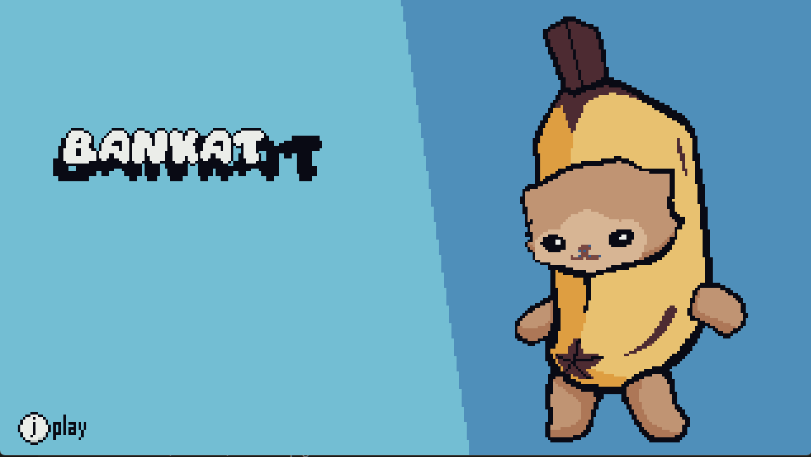
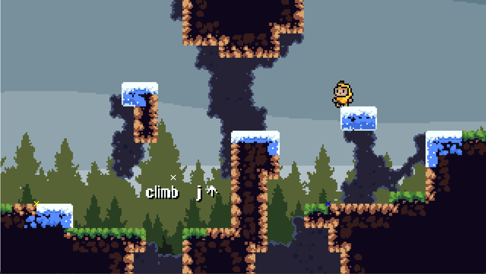
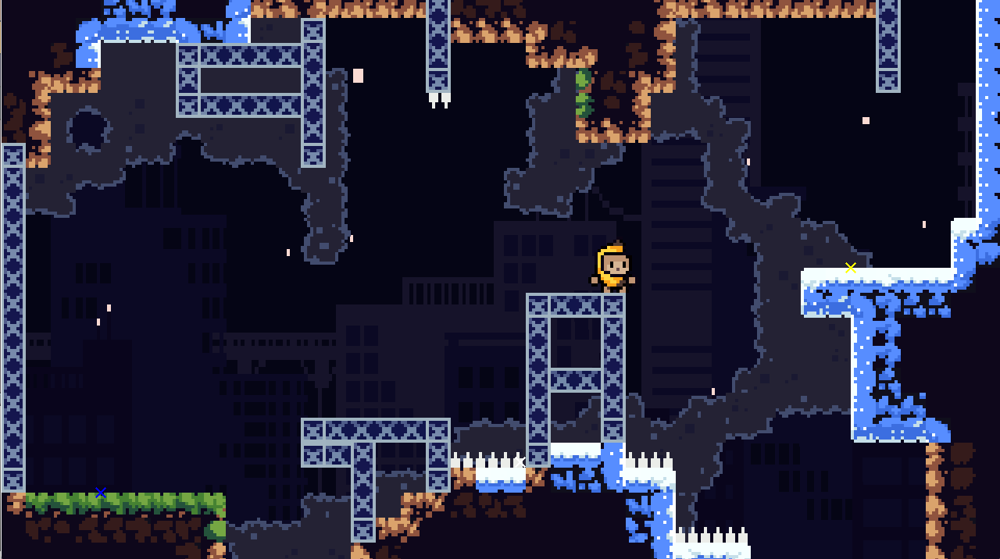
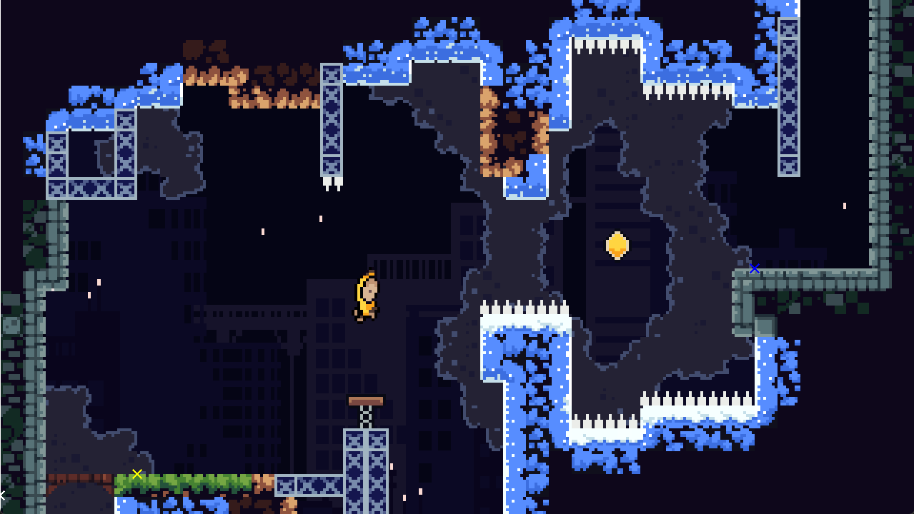
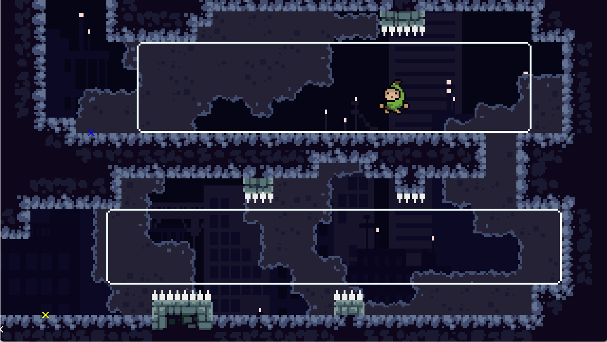

# test
how to run: 

    open cmd
    create folder name obj
    make 

control:
    debug:
    keypad 7: turn debug(on/off)
    keypad 4,6: camera zoom

    player control:
    wasd: move
    space: jump
    j: wall grab
    k: dash

screen shots:

    

    

    

sk engine is a simple 2d game engine using sdl and opengl written my Mr. MinhFli(me)

